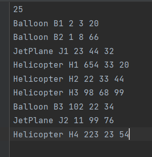
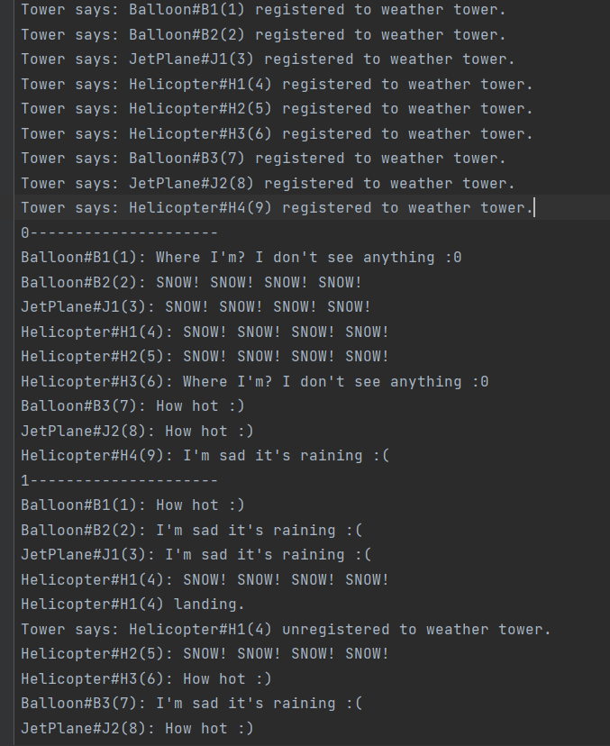

## avaj-launcher

*Этот проект заключается в том, чтобы реализовать программу на основании UML-диаграммы классов (man/avaj_uml.png).*

На вход программа получает файл со сценарием (scenario.txt). В сценарии описаны летательные аппараты с координатами (Balloon, Helicopter, JetPlane).
Также в файле scenario.txt имеется число симуляций изменения погоды рандомным способом.

При смене погоды (туман, дождь, снег, жара) происходит изменение координат летательного аппарата.
Летательный аппарат не может подниматься на высоту > 100. Если высота летательного аппарата становится <= 0, то аппарат приземляется.

**Запустить программу:**
1) find * -name "*.java" > sources.txt
2) javac @sources.txt
3) java ru.school21.avaj.launcher.simulator.Simulator scenario.txt

Результатом работы программы будет файл simulation.txt

Проект индивидуальный, сделан в ноябре 2022.
